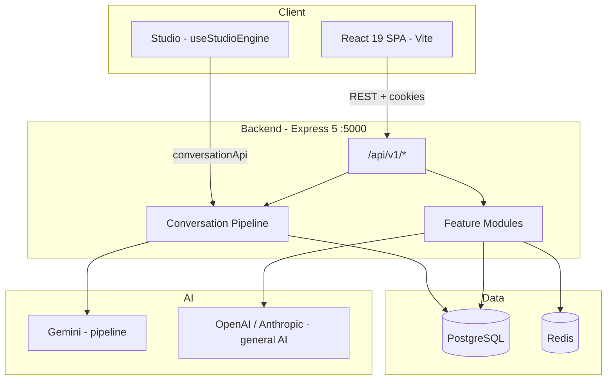
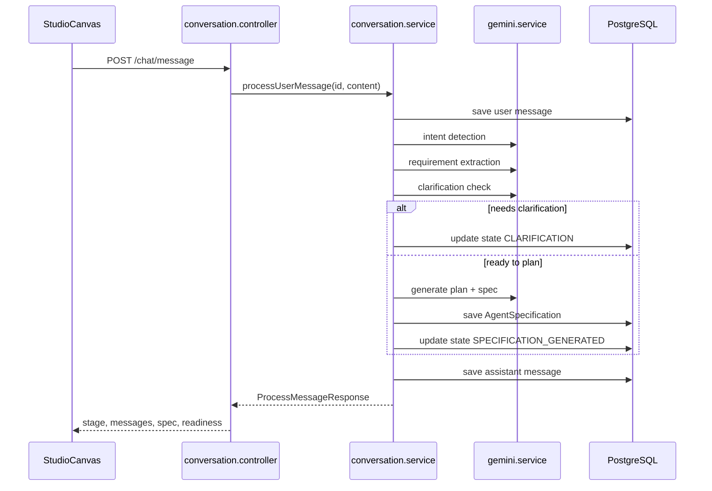
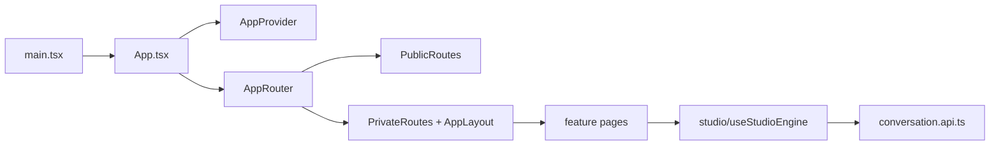

# Vibe Agent — System Architecture

## High-Level Topology



---

## Repository Layout

```
Ai Agent/
├── frontend/          React SPA
├── backend/           Express API + Prisma
├── .agents/           AI knowledge base (this folder)
└── .runtime/          Runtime agent specs (separate concern)
```

---

## Backend Architecture

**Entry:** `backend/src/server.ts` → HTTP server + Socket.IO + Prisma connect

**App setup:** `backend/src/app.ts`
- Helmet, CORS, rate limit, compression
- JSON body parser (10mb)
- Routes at `/api/v1`
- Global error handler

**Route mounting:** `backend/src/routes/index.ts`

### Two Backend Patterns

| Pattern | Location | Used for |
|---------|----------|----------|
| **Pipeline services** | `backend/src/services/` | Conversation AI engine (intent, planner, spec…) |
| **Feature modules** | `backend/src/modules/` | CRUD features (agents, workflows, billing…) |

Module internal structure:
```
modules/<name>/
  ├── <name>.routes.ts
  ├── <name>.controller.ts
  ├── <name>.service.ts
  ├── <name>.repository.ts
  ├── <name>.validation.ts   (Zod)
  ├── <name>.types.ts
  └── index.ts
```

---

## Conversation Pipeline Architecture



**Controller:** `backend/src/controllers/conversation.controller.ts`  
**Service:** `backend/src/services/conversation/conversation.service.ts`  
**Prompts:** `backend/src/prompts/` (intent, clarification, conflict, specification…)

---

## Frontend Architecture



**State management:**
- **TanStack Query** — server data fetching
- **Zustand** — client UI state (notifications, etc.)
- **useStudioEngine** — Studio conversation state (local hook, not global store)

**UI components:** `frontend/src/components/ui/` (shadcn-style)

---

## Database Schema

See `backend/prisma/schema.prisma`.

Entity relationships:
```
User 1──* Workspace
User 1──* Conversation
Conversation 1──* Message
Conversation 1──1 ConversationState
Conversation 1──* AgentSpecification
```

---

## Authentication Flow

- JWT access + refresh tokens (`backend/src/modules/auth/`)
- Cookie parser enabled on Express
- Conversation routes use `authenticateJwt` middleware
- Dev fallback user ID when no auth context

Frontend: `frontend/src/features/auth/` + axios interceptors in `frontend/src/lib/axios.ts`

---

## Real-Time (Socket.IO)

Initialized in `backend/src/server.ts` via `initSocket()`.

Primary Studio flow is **REST-based** today. Socket.IO is available for future streaming/live updates.

---

## External Services

| Service | Purpose | Config |
|---------|---------|--------|
| PostgreSQL | Primary DB | `DATABASE_URL` |
| Redis | Queues, cache | `REDIS_URL` |
| Gemini | Pipeline LLM | `GEMINI_API_KEY` |
| OpenAI | General AI | `OPENAI_API_KEY` |
| Anthropic | General AI | `ANTHROPIC_API_KEY` |
| Stripe | Billing | `STRIPE_SECRET_KEY` |
| SMTP | Email | `SMTP_*` |

See `backend/.env.example`.

---

## API Response Envelope

Most endpoints return:
```json
{
  "success": true,
  "data": { ... }
}
```

Conversation message response includes:
- `currentStage`, `needsClarification`, `question`, `options`
- `warnings`, `improvements`, `readiness`
- `specification` (when complete)

---

## Known Gaps (Docs vs Implementation)

| Documented aspiration | Current reality |
|----------------------|-----------------|
| NestJS backend | Express 5 |
| BullMQ | Bull in package.json |
| React Flow canvas everywhere | Studio is chat-first; canvas modules may be partial |
| OpenTelemetry everywhere | Winston logger in use |
| Full multi-tenant row isolation | User/workspace models exist; verify tenant middleware before assuming |

Always verify in code before implementing against aspirational docs.
