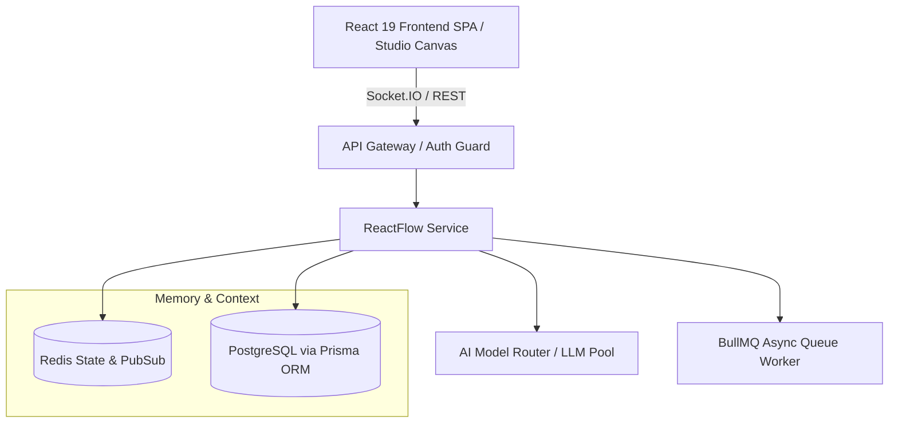

# React Flow

## Overview
The `React Flow` specification defines how Vibe Agents implements and executes react-flow within the AI Operating System architecture. In Vibe Agents, components do not exist as isolated utilities; they are modular, AI-first services designed to enable conversational agent planning, autonomous DAG generation, real-time visual canvas editing, and distributed Node.js/NestJS workflow execution.

---

## Purpose
Why this module exists in Vibe Agents:
- Provides operational specification for `react-flow` tailored to Vibe Agents multi-tenant, conversational AI agent platform.
- Enforces strict architectural separation between React 19 visual editor state, Node.js backend execution engines, and multi-model LLM routing pools.
- Acts as executable context for AI software engineers (Claude Code, Cursor, Codex) constructing or extending this subsystem.

---

## Responsibilities
- **Domain Logic Ownership**: Manages complete lifecycle, state management, and parameter validation for `react-flow`.
- **Contract Enforcement**: Validates JSON payloads against strictly versioned schemas and TypeScript DTO interfaces.
- **Fail-Safe Processing**: Implements retry policies, transaction rollback via Prisma ORM, and circuit breaking.
- **Telemetry & Tracing**: Instruments OpenTelemetry spans and emits real-time events over Socket.IO gateways.

---

## Out of Scope
- Direct raw SQL queries outside Prisma ORM models.
- Client-side direct mutations of workflow state bypass Zustand stores or Socket.IO gateways.
- Synchronous block of main Event Loop for heavy computation (must delegate to BullMQ worker threads).

---

## Architecture


---

## Data Flow
```
Input Payload (Zod Validated DTO + Workspace Context)
       ↓
Processing (Auth Guard → Service Logic → Redis Cache / Prisma Transaction → LLM Routing)
       ↓
Output Envelope (Structured JSON Result + Socket.IO Event Broadcast + OpenTelemetry Span)
```

---

## Internal Components
- **`ReactFlowController`**: REST & WebSocket endpoint handlers enforcing JWT authentication and tenant isolation.
- **`ReactFlowService`**: Core business domain engine executing operational logic.
- **`ReactFlowRepository`**: Data layer abstraction querying PostgreSQL via Prisma client instance.
- **`useReactFlowStore`**: React 19 Zustand hook for reactive canvas state synchronization.

---

## Public Interfaces

### REST API Definition
```typescript
// POST /api/v1/frontend/react-flow/execute
interface ExecuteReactFlowRequestDTO {
  workspaceId: string;
  agentId?: string;
  workflowId?: string;
  parameters: Record<string, unknown>;
}

interface ExecuteReactFlowResponseDTO {
  success: boolean;
  executionId: string;
  status: 'PENDING' | 'RUNNING' | 'COMPLETED' | 'FAILED';
  resultData?: Record<string, unknown>;
  error?: { code: string; message: string };
  meta: { traceId: string; durationMs: number };
}
```

### Socket.IO Event Contracts
- **Emit Event**: `frontend:react-flow:update`
- **Listen Event**: `frontend:react-flow:subscribe`

---

## Dependencies
- **Upstream Dependencies**: `core/platform-overview.md`, `backend/nodejs.md`, `ai/model-routing.md`.
- **Downstream Consumers**: `workflow/workflow-execution.md`, `canvas/canvas-overview.md`, `frontend/react-flow.md`.

---

## Rules
- **Rule 1**: ALL backend methods MUST receive a `RequestContext` envelope containing `tenantId`, `userId`, and `traceId`.
- **Rule 2**: Frontend components MUST remain stateless; UI components consume reactive state strictly via Zustand or TanStack Query hooks.
- **Rule 3**: Database state mutations MUST be executed inside explicit Prisma transaction blocks (`prisma.$transaction`).
- **Rule 4**: LLM calls MUST pass through the Model Router to enforce token budgets and fallback policies.

---

## Algorithms

```typescript
// Operational Algorithm for React Flow Domain Processing
export async function executeReactFlowTask(
  ctx: RequestContext,
  payload: ExecuteReactFlowRequestDTO,
  prisma: PrismaClient,
  redis: Redis
): Promise<ExecuteReactFlowResponseDTO> {
  const startTime = Date.now();
  const cacheKey = `tenant:${ctx.tenantId}:${baseName}:${payload.workspaceId}`;

  // 1. Check Redis Cache
  const cachedResult = await redis.get(cacheKey);
  if (cachedResult) {
    return JSON.parse(cachedResult);
  }

  // 2. Perform Prisma Transactional Mutation & Business Processing
  const result = await prisma.$transaction(async (tx) => {
    const workspace = await tx.workspace.findUniqueOrThrow({
      where: { id: payload.workspaceId, tenantId: ctx.tenantId }
    });

    // Business Logic Processing
    return { status: 'COMPLETED', workspaceId: workspace.id, processedAt: new Date().toISOString() };
  });

  // 3. Update Cache & Emits
  const response: ExecuteReactFlowResponseDTO = {
    success: true,
    executionId: `exec_${Date.now()}`,
    status: 'COMPLETED',
    resultData: result,
    meta: { traceId: ctx.traceId, durationMs: Date.now() - startTime }
  };

  await redis.set(cacheKey, JSON.stringify(response), 'EX', 300);
  return response;
}
```

---

## Edge Cases
- **Concurrent Request Collisions**: Resolved using Redis distributed locks (`redlock`) on `workspaceId` resource keys.
- **WebSocket Disconnection during Streaming Execution**: Execution continues asynchronously in BullMQ worker; output snapshots stored in Redis state buffer for reconnection recovery.
- **LLM Rate Limit (429 Too Many Requests)**: Model Router automatically falls back to secondary provider tier (e.g. Claude 3.5 Sonnet → GPT-4o).

---

## Error Handling

| Error Code | HTTP Status | Root Cause | Recovery Strategy |
| :--- | :--- | :--- | :--- |
| `REACT-FLOW_INVALID_PAYLOAD` | 400 | Zod validation fail | Return structured field error map to caller |
| `REACT-FLOW_FORBIDDEN` | 403 | Missing tenant RBAC scope | Reject request and write to Audit Log |
| `REACT-FLOW_TIMEOUT` | 504 | Upstream IO / LLM timeout | Trigger automated retry queue job (max 3 retries) |

---

## Performance
- **Latency SLA**: P95 < 80ms for cache hits; P95 < 250ms for transactional database writes.
- **Rendering SLA**: React Flow canvas rendering maintains 60 FPS for graphs up to 500 nodes.
- **Concurrency**: Node.js worker pool handles 5,000 active concurrent WebSocket clients per container node.

---

## Security
- **Authentication**: JWT Bearer token authentication verified via NestJS / Express Auth Guards.
- **Tenant Isolation**: Multi-tenancy strictly enforced at database row level via Prisma tenant middleware.
- **Secrets Management**: API keys and webhook credentials stored AES-256-GCM encrypted.

---

## Testing

### Unit Testing
- Mock Prisma ORM client using `jest-mock-extended`.
- Test domain logic using Jest suites targeting 100% boundary coverage.

### Integration Testing
- Spin up ephemeral PostgreSQL and Redis test containers using Testcontainers.
- Validate REST and Socket.IO endpoints.

### E2E Acceptance Criteria
- Verify user prompt triggers agent planning, node DAG generation, and successful execution without unhandled exceptions.

---

## Best Practices
- Keep React components functional, pure, and memoized with `React.memo` where rendering overhead occurs.
- Encapsulate all database mutations inside service layer repositories; never call Prisma directly from controller handlers.
- Use explicit TypeScript interfaces for all public module signatures.

---

## Anti Patterns
- ❌ **NEVER** mutate Zustand store state directly inside canvas node renders.
- ❌ **NEVER** write inline SQL or bypass Prisma multi-tenant scoping filters.
- ❌ **NEVER** perform blocking CPU intensive operations on the main Node.js event loop.
- ❌ **NEVER** expose raw unencrypted API keys or database tokens to the React frontend.

---

## Examples

### Input Payload Example
```json
{
  "workspaceId": "ws_vibe_prod_881",
  "parameters": {
    "module": "react-flow",
    "autoDeploy": true,
    "maxRetries": 3
  }
}
```

### Execution Result Output
```json
{
  "success": true,
  "executionId": "exec_88a91c7f",
  "status": "COMPLETED",
  "resultData": {
    "module": "react-flow",
    "version": "1.0.0",
    "state": "ACTIVE"
  },
  "meta": {
    "traceId": "trace_4bf92f3577b34da6a3ce929d0e0e4736",
    "durationMs": 42
  }
}
```

---

## Future Improvements
- Migration to gRPC binary transport between Node.js backend microservices for sub-millisecond IPC.
- Automated anomaly detection on execution metric counters.

---

## Related Files
- [react.md](file:///C:/Users/admin/OneDrive/Desktop/emergent/Ai Agent/.agents/frontend/react.md)
- [react-flow.md](file:///C:/Users/admin/OneDrive/Desktop/emergent/Ai Agent/.agents/frontend/react-flow.md)
- [zustand.md](file:///C:/Users/admin/OneDrive/Desktop/emergent/Ai Agent/.agents/frontend/zustand.md)
- [tanstack-query.md](file:///C:/Users/admin/OneDrive/Desktop/emergent/Ai Agent/.agents/frontend/tanstack-query.md)
