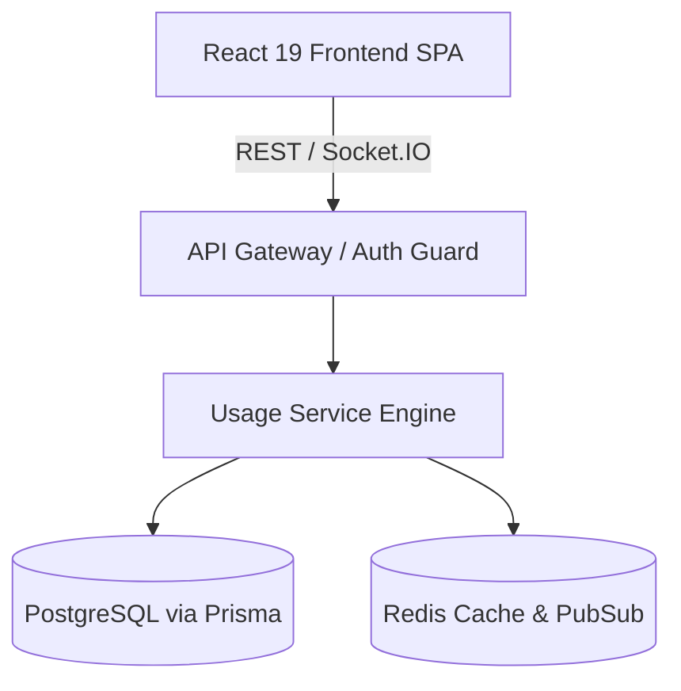

# Usage Specification

## Overview
The `Usage` specification defines operational configuration, schema definitions, and platform capabilities for Usage in Vibe Agents.

---

## Technical Stack Alignment
- **Runtime**: Node.js (v20+ LTS runtime)
- **Backend Architecture**: Express.js / Node.js API with TypeScript
- **Real-Time Communication**: Socket.IO
- **Database & Persistence**: PostgreSQL with Prisma ORM
- **Queue & Caching**: Redis with Bull / BullMQ
- **Frontend Architecture**: React + Vite + TypeScript + TailwindCSS + React Flow + Zustand + TanStack Query

---

## Responsibilities
- Define system registration, validation schemas, and runtime configurations for `Usage`.
- Provide multi-tenant isolation, RBAC security scoping, and trace instrumentation.
- Enforce schema contracts and fail-safe execution bounds.

---

## Architecture


---

## Data Contracts & Schemas
```json
{
  "$schema": "http://json-schema.org/draft-07/schema#",
  "title": "UsageSpec",
  "type": "object",
  "properties": {
    "id": { "type": "string" },
    "workspaceId": { "type": "string" },
    "name": { "type": "string" },
    "status": { "type": "string", "enum": ["ACTIVE", "INACTIVE", "DEPRECATED"] },
    "config": { "type": "object" }
  },
  "required": ["id", "workspaceId", "name", "status"]
}
```

---

## Rules
- **Rule 1**: All configurations MUST be tenant-scoped using `workspaceId`.
- **Rule 2**: Database state modifications MUST use Prisma ORM transaction blocks.
- **Rule 3**: Sensitive tokens or credentials MUST be encrypted using AES-256-GCM.

---

## Related Specifications
- [PLATFORM.md](file:///C:/Users/admin/OneDrive/Desktop/emergent/Ai Agent/.platform/PLATFORM.md)
- [CONFIG.md](file:///C:/Users/admin/OneDrive/Desktop/emergent/Ai Agent/.platform/CONFIG.md)
