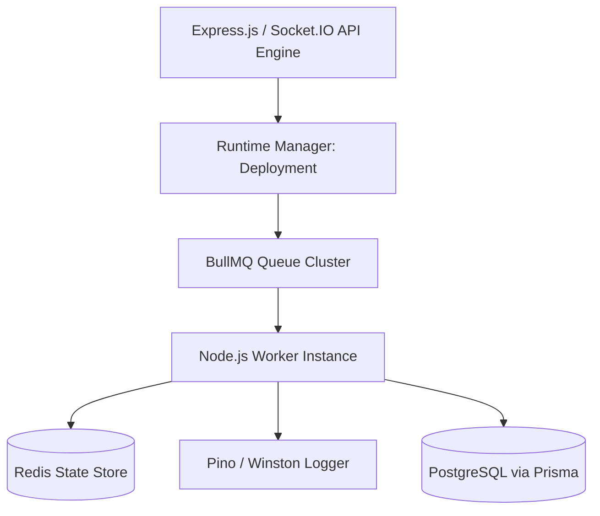

# Deployment Runtime Specification

## Overview
The `Deployment` runtime specification governs real-time execution state, queue metrics, worker thread allocations, and memory checkpoints for Deployment in Vibe Agents.

---

## Technical Stack Alignment
- **Runtime Environment**: Node.js (v20+ LTS runtime engine)
- **Backend Service Framework**: Express.js / Node.js API
- **Async Job Queue**: Bull / BullMQ backed by Redis
- **Real-Time Messaging**: Socket.IO event gateways
- **Persistence & Snapshots**: PostgreSQL with Prisma ORM
- **Observability**: OpenTelemetry tracing & Winston/Pino structured logging

---

## Operational Responsibilities
- Monitor dynamic process lifecycle, state transitions, and worker queue depths for `Deployment`.
- Manage Redis state buffers, memory garbage collection, and checkpoint recovery snapshots.
- Enforce strict tenant context propagation (`tenantId`, `userId`, `traceId`) across runtime boundaries.

---

## Runtime Architecture


---

## State Model & Data Contracts
```typescript
interface DeploymentRuntimeState {
  id: string;
  tenantId: string;
  status: 'ACTIVE' | 'IDLE' | 'PAUSED' | 'FAILED' | 'RECOVERING';
  metrics: {
    memoryUsageBytes: number;
    cpuPercent: number;
    activeWorkerJobs: number;
  };
  lastHeartbeat: string;
}
```

---

## Engineering Rules
- **Rule 1**: All runtime state MUTATIONS must write atomically to Redis before emitting Socket.IO state events.
- **Rule 2**: Worker process crashed states must auto-trigger checkpoint recovery from PostgreSQL snapshots.
- **Rule 3**: Log outputs must format strictly as structured JSON with `traceId` correlation headers.

---

## Related Runtime Specs
- [RUNTIME.md](file:///C:/Users/admin/OneDrive/Desktop/emergent/Ai Agent/.runtime/RUNTIME.md)
- [STATUS.md](file:///C:/Users/admin/OneDrive/Desktop/emergent/Ai Agent/.runtime/STATUS.md)
- [CONFIG.md](file:///C:/Users/admin/OneDrive/Desktop/emergent/Ai Agent/.runtime/CONFIG.md)
